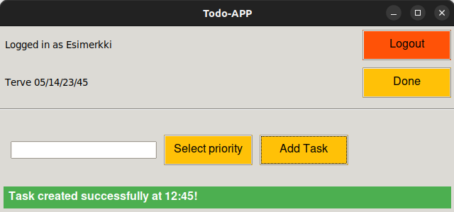

# **Käyttöohje**
## **Ohjelman käynnistäminen**
 **1. Aluksi asenna riippuvuudet komennolla:**
```bash
poetry install
```

 **2. Suorita vaadittavat alustoimenpiteet komennolla:**
```bash
poetry run invoke build
``` 

 **3. Tämän jälkeen sovelluksen voi käynnistää komennolla:**
```bash
poetry run invoke start
```
****
## **Kirjautuminen**
Sovellus alkaa kirjautumis näkymästä:

 

Kirjautuminen onnistuu kirjoittamalla olemassaoleva käyttäjätunnus sekä syötekenttään ja painamalla "Sign in"-nappia.

# **Uuden käyttäjän luominen**
Kirjautumisnäkymästä on mahdollista siirtyä rekisteröintinäkymään Nappia "Sign up " painamalla.

Uusi käyttäjä luodaan syöttämällä tiedot syötekenttiin ja painamalla "Register"-painiketta Huom. käyttäjänimen on oltava uniikki sekä vähintään neljä merkkiä:

 

Klikkaamalla Back-nappia päästään takaisin kirjautumis näkymälle.

# **Todojen luominen ja tehdyksi merkkaaminen**
Kun kirjautuminen onnistuu käyttäjä voi hallinnoida todojaan:

 

Käyttäjä voi luoda uuden todon kirjoittamalla syöttökenttään tehtävän ja painamalla "Add task" nappia. Todo ilmestyy ikkunaan ja koska ei olla valittu prioriteettia, niin todon prioriteetti on low oletuksena.

Todolle voidaan antaa prioriteetti klikkaamalla 'Select priority' nappia, jolloin esiintyy valikko, josta voidaan valita: 'low', 'medium' tai "high". Prioriteetti muuttuu tietokannassa.

Käyttäjä voi merkata olemassaolevia todoa tehdyksi painikkeella "Done", jolloin todo poistuu ikkunasta

Lopuksi Klikkaamalla oikean ylänurkan painiketta "Logout" painamalla käyttäjä kirjautuu ulos sovelluksesta ja palaa aloitus näyttöön eli kirjatumis näyttöön.