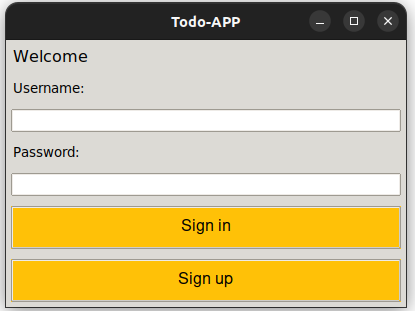
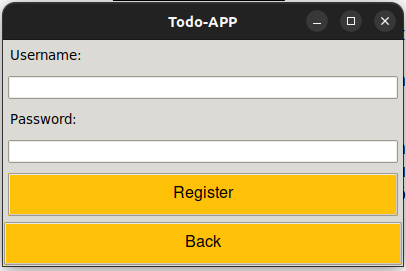
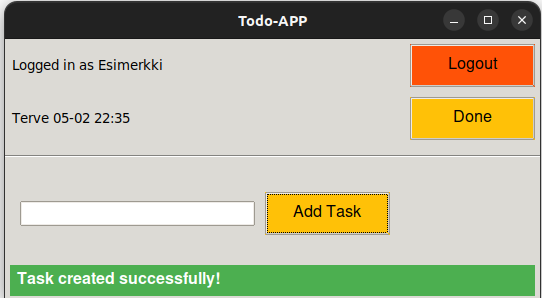

# **Käyttöohje**
## **Ohjelman käynnistäminen**
 **1. Aluksi asenna riippuvuudet komennolla:**
```bash
poetry install
```

 **2. Suorita vaadittavat alustoimenpiteet komennolla:**
```bash
poetry run invoke build
``` 

 **3. Tämän jälkeen sovelluksen voi käynnistää komennolla:**
```bash
poetry run invoke start
```
****
## **Kirjautuminen**
Sovellus alkaa kirjautumis näkymästä:

 

Kirjautuminen onnistuu kirjoittamalla olemassaoleva käyttäjätunnus sekä syötekenttään ja painamalla "Sign in"-nappia.

# **Uuden käyttäjän luominen**
Kirjautumisnäkymästä on mahdollista siirtyä rekisteröintinäkymään Nappia "Sign up " painamalla.

Uusi käyttäjä luodaan syöttämällä tiedot syötekenttiin ja painamalla "Register"-painiketta:

 

# **Todojen luominen ja tehdyksi merkkaaminen**
Kun kirjautuminen onnistuu käyttäjä voi hallinnoida todojaan:
 

Käyttäjä voi merkata olemassaolevia todoa tehdyksi painikkeella "Done" sekä uusien todojen luomisen kirjoittamalla syötekenttään tehtävän todon ja painamalla "Add task"-painiketta.

Lopuksi Klikkaamalla oikean ylänurkan painiketta "Logout" painamalla käyttäjä kirjautuu ulos sovelluksesta ja palaa aloitus näyttöön eli kirjatumis näyttöön.