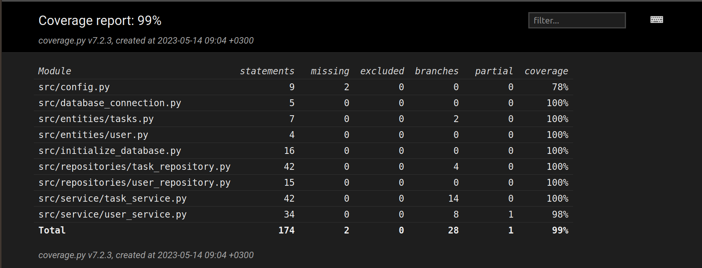

# **Testausdokumentti**
Ohjelman toimivuutta on varmistettu sekä automatisoiduilla yksikkö- ja integraatiotesteillä käyttäen unittestia että manuaalisesti suoritetuilla järjestelmätason testeillä.

## Yksikkö- ja integraatiotestauksen suorittaminen
***
### **Sovelluslogiikka**
Sovelluslogiikasta vastaa TodoService-luokka sekä UserService-luokat. Test_todo_service-testiluokka varmistaa TodoService-luokan toimivuuden tarkistamalla sovelluslogiikan oikeellisuuden. Test_user_service-testiluokka taas varmistaa UserServicen-luokan toimivuuden. Integraatiotesti tasolla Test_todo_service-testiluokka sekä Test_user_service-testiluokka varmistavat myös repositorien luokkien, UserDatabase ja TaskDatabase toimivuutta.
UserDatabase-luokan toiminnallisuutta testataan lisäksi myös Test_UserDatabase-testiluokan avulla.

### **Testauskattavuus**
Ottamatta huomioon ui luokkia, sovelluksen testauksen haarautumakattavuus on 99%

Testikattavuuden ulkopuolelle jätettiin build.py

## Järjestelmätestaus
***
Sovelluksen järjestelmätestaus on suoritettu manuaalisesti.
### **Asennus ja konfigurointi**
Sovellus on ladattu ja testattu [käyttöohjeessa](./Käyttöohje.md) kuvatulla tavalla sekä macOS- että Linux-käyttöjärjestelmille. Testauksessa on käytetty erilaisia konfiguraatioita, jotka on määritelty .env-tiedostossa.

## Sovellukseen jääneet laatuongelmat
Emme saaneet näkyväksi aikaa, jolloin todo luotiin. Jokaiselle todolla prioriteetti, mutta sitä ei näy meidän käyttöliittymässä.