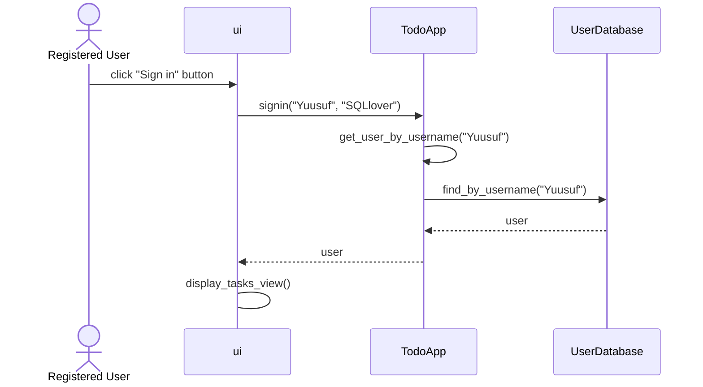

# **Arkkitehtuurikuvaus**
## **Sovelluslogiikka**

User-luokka sisältää käyttäjän nimen, salasanan ja viittauksen käyttäjän tehtävälistaan (TaskList). Tehtävälista sisältää luettelon tehtävistä (Task). Jokaisella tehtävällä on nimi ja tila, joka kertoo onko tehtävä suoritettu vai ei.

****
## **Sekvenssikaavio**

