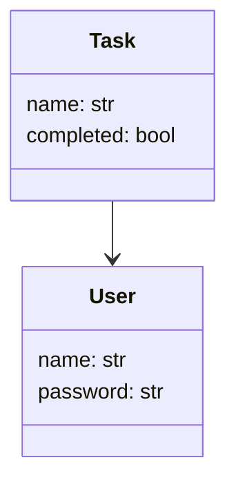
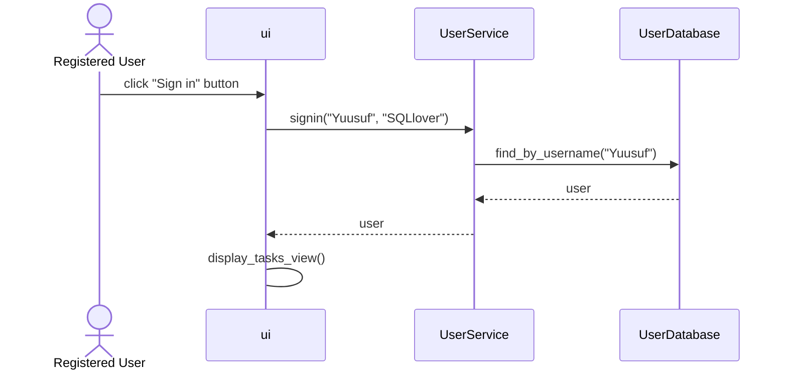

# **Arkkitehtuurikuvaus**

## **Rakenne**
Koodin pakkaus rakenne on seuraavanlainen

 

ui sisältää tietoa käyttöliittymästä, services sisältää  tietoa sovelluslogiikasta ja repositories vastaa pysyvätallennuksesta. Pakkaus entities sisältää luokat user, tasks, tasklist jotka kuvastavat tietokohteita, jota sovelluskäyttää.
****
## **Käyttöliittymä**
Sovelluksemme käyttöliittymä sisältää kolme näkymää: Kirjautumisnäkymä, rekisteröitymisnäkymä ja tehtävälistalista näkymä. Jokainen näistä näkymistä ollaan toteutettu omissa luokissa. Näkymistä vastaa UI luokka. Käyttöliittymä kutsuu ainoastaan TaskService-luokan  sekä UserService-luokan metodeja.

## **Sovelluslogiikka**

User-luokka sisältää käyttäjän nimen ja salasanan. Jokaisella tehtävällä on nimi ja tila, joka kertoo onko tehtävä suoritettu vai ei.

****
## **Sekvenssikaavio**

