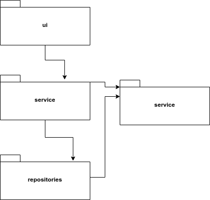
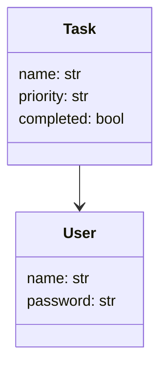
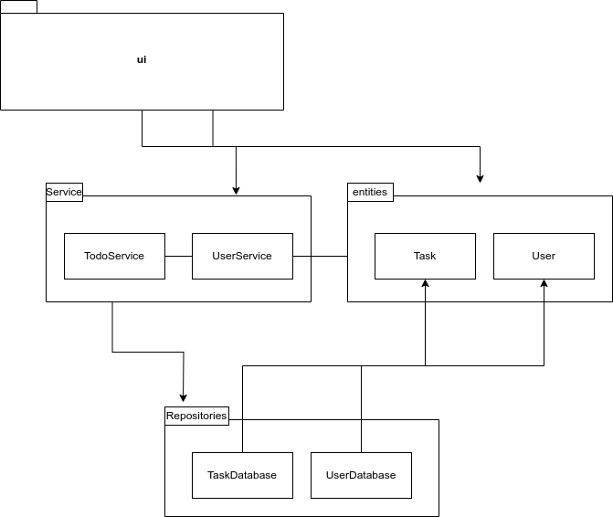
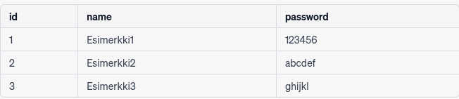
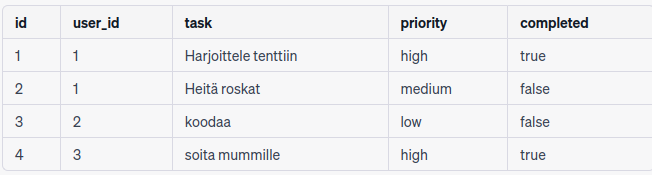
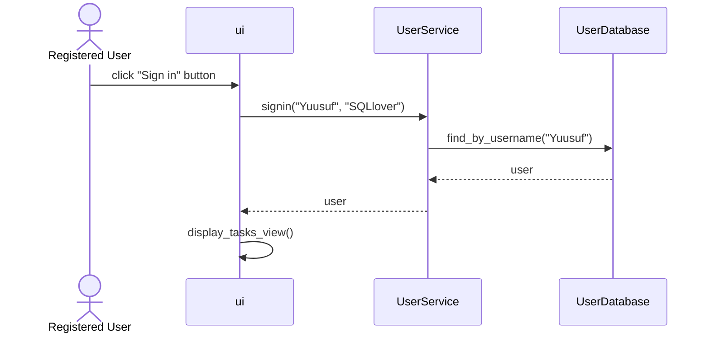
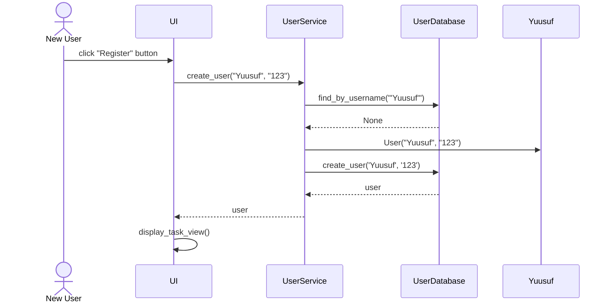
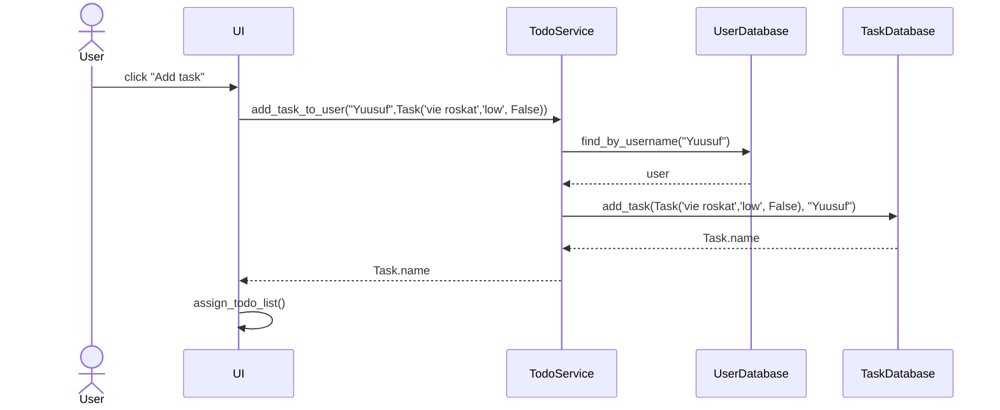

# **Arkkitehtuurikuvaus**

## **Rakenne**
***
Koodin pakkaus rakenne on seuraavanlainen

 

ui sisältää tietoa käyttöliittymästä, services sisältää  tietoa sovelluslogiikasta ja repositories vastaa pysyvätallennuksesta. Pakkaus entities sisältää luokat user, tasks, tasklist jotka kuvastavat tietokohteita, jota sovelluskäyttää.
****
## **Käyttöliittymä**
Sovelluksemme käyttöliittymä sisältää kolme näkymää: Kirjautumisnäkymä, rekisteröitymisnäkymä ja tehtävälistalista näkymä. Jokainen näistä näkymistä ollaan toteutettu omissa luokissa. Näkymistä vastaa UI luokka. Käyttöliittymä kutsuu ainoastaan TaskService-luokan  sekä UserService-luokan metodeja.

## **Sovelluslogiikka**

User-luokka sisältää käyttäjän nimen ja salasanan. Jokaisella tehtävällä on nimi, prioriteetti ja tila, joka kertoo onko tehtävä suoritettu vai ei. Jokaisen tehtävän prioriteetti on oletusarvoisesti 'low'

Todopalvelu käyttää TodoRepositoryn ja UserRepositoryn nimisiä luokkia, jotka sijaitsevat tietojen tallennuksesta vastaavassa repositories-pakkauksessa, jotta se voi käsitellä käyttäjien ja tehtävien tietoja.

Ohjelman osien suhdetta kuvaava kaavio:
 
***
## **Tiedon pysyväistallennus**

Koodin pakkausrakenteissa sisällä sijaitsevat repositories, nimittäin TaskDatabase ja UserDatabase luokat, vastaavat datan tallentamisesta  Nämä luokat toteuttavat Repository-suunnittelumallia. Luokat toimivat suurinpiirtein samalla logiikalla. 
UserDatabase-luokka ja  TaskDatabase-luokka käyttää SQLite-tietokantaa käyttäjien tai tehtävien tietojen tallentamiseen. Luokkien konstruktori ottaa tietokantayhteyden parametrina ja tallentaa sen instance-muuttujaan, jota käytetään kaikissa metodeissa tietokantayhteyden säilyttämiseksi. Tiedot tallennetaan SQLite-tietokannan tauluihin users ja Tasks, joka alustetaan initialize_database.py-tiedostossa.

Alla olevassa kuvassa esitellään, miltä ohjelmamme käyttämä tietokanta-taulujen rakenne näyttää.
users taulu:

tasks taulu:

****

## **Päätoiminnallisuuksia**
### Kuvataan ohjelman toimintalogiikkaa sekvenssikaavioden avulla

### **Kirjautuminen**
Kun käyttäjä kirjoittaa käyttäjätunnuksen ja salasanan kirjautumisnäkymän syötekenttiin, ja sen jälkeen klikkaa Login-painiketta, siirtyy sovelluksen ohjaus seuraaviin vaiheisiin:

Kun käyttäjä painaa Sign in-nappia, ohjelma reagoi tähän, jolloin se kutsuu UserService-luokan signing-metodia ja antaa sille parametreiksi käyttäjätunnuksen ja salasanan. Sovelluslogiikka käyttää UserDatabase-luokkaa apunaan tarkistaakseen, onko käyttäjätunnus olemassa. Jos käyttäjätunnus on olemassa, sovellus tarkistaa salasanan. Jos salasanat täsmäävät, käyttäjä pystyy kirjautumaan sisään. Tämän jälkeen käyttöliittymä vaihtaa näkymän TaskView-näkymään eli päänäkymään, ja tuo onnistuneesti kirjautuneen käyttäjän näkymään käyttäjän tekemättömät tehtävät.

### **Käyttäjän luominen**

Uuden käyttäjän luonnin aikana kutsutaan metodia 'create_user' sovelluslogiikassa ja välittää sille parametrina uuden käyttäjän tiedot. Sovelluslogiikka käyttää UserDatabase luokkaa tarkistaakseen, onko käyttäjätunnus jo käytössä. Jos käyttäjätunnusta ei ole käytössä, sovelluslogiikka luo uuden User-olion, jonka se völttää UserDatabse-luokan 'create'-metodille. Tämän jälkeen uusi käyttäjä siirtyy TaskView-näkymään, ja luotu käyttäjä kirjataan sisään.

### **Uuden tehtävän lisäämine**
Uuden todon luominen tapahtuu klikkaamalla "add task"-nappia. Kaikki taskit ovat prioriteetiltaan oletusarvoisesti "low"

Todon luonnin aikana kutsutaan metodia 'add_task_to_user' sovelluslogiikassa ja välittää sille parametrina todo-olio ja käyttäjän nimen. Sovelluslogiikka tallentaa todon TaskDatabase-luokan add_task-metodia käyttäen.Lopuksi käyttöliittymä päivittää näytettävät tehtävät kutsumalla assign_todo_list-metodiaan. 