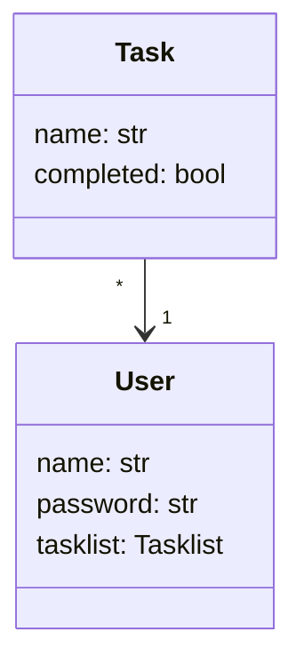

```mermaid
 classDiagram
      Task "*" --> "1" User
      class User{
          name: str
          password: str
          tasklist: Tasklist
      }
      class Task{
          name: str
          completed: bool
      }
```