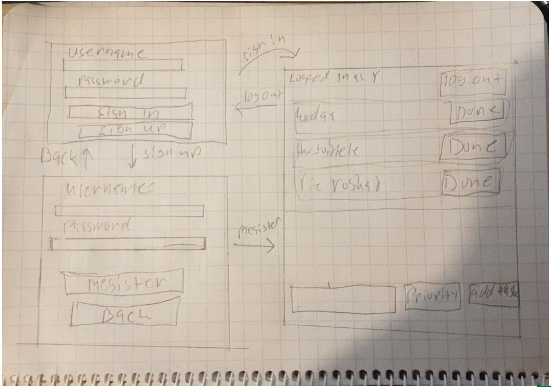

# Vaatimuusmääritttely

## Käyttötarkoitus
Sovelluksen tarkoituksena on tarjota työkalu yksilöille heidän tehtäviensä/tavoitteidensa hallintaan. Ohjelmalla voidaan luoda tehtäviä ja pitää listaa tekemättömistä tehtävistä, _todoista_.
Sovellus on suunniteltu mahdollistamaan usean rekisteröityneen käyttäjän käytön, joista jokaisella on oma ainutlaatuinen tehtävälista käytettävissään.

## Käyttäjät
Sovelluksen käyttöoikeudet ovat räätälöity ainoastaan yhdelle käyttäjäroolille, nimittäin normaalille käyttäjälle.

## Käyttöliittymäluonnos

Sovellus aukeaa kirjautumis näkymään, josta mahdollista siirtyä rekisteröitymis näkymään klikkaamalla "Sign up"-painiketta toisaalta, jos on rekistöröitynyt, niin klikkaamalla "Sign in"-painiketta voidaan siirtyä tehtävälista näkymälle. Kun kirjaudutaan ulos, niin päädytään takaisin kirjatumis näkyälle. Rekisteröitymis näkymästä päästään suoraan tehtävälista näkymällä, kun ollaan luotu käyttäjä. Rekisteröitymis näkymästä voidaan palata takasin kirjautumis näkymälle klikkaamalla "Back"-nappia
## Sovelluken tarjoama toiminnallisuus
### Ennen Kirjautumista
- Käyttäjä voi rekistöröityö sovellukseen luomalla käyttäjätunnuksen, jonka avulla käyttäjä kykenee kirjautumaan järjestelmään. "Tehty"
  - Käyttäjä tunnuksen on oltava uniikki ja vähintään 4 merkin pituinen "Tehty"
-Käyttäjä kykenee kirjautumaanjärjestelmään olemassa olevan käyttäjätunnuksen avulla. "Tehty"
  - Kirjautuminen onnistuu syöttämällä oikea käyttäjänimi ja siihen vastaava salasana "Tehty"
  - Jos ei olla rekistöröity tai käyttäjätunnus tai salasana ovat väärin, niin järjestelmä ilmoittaa siitä. "Tehty"

### Kirjautumisen jälkeen 
- Käyttäjä näkee luomansa todot. "Tehty"
- Käyttäjä voi luoda uuden todon. "Tehty"
  - Todon luomisen aikana käyttäjä voi antaa todolle prioriteetin "Tehty"
  - Käyttäjä saa ilmoituksen siitä, että todo on luotu onnistuneesti "Tehty"
  - Todon näkyy vain sielle käyttäjälle, jonka sen luonut "Tehty"
  - Nähdään myös päiväys sekä aika, jolloin todo luotiin "Tehty"
- Käyttäjä voi merkitä todon tehdyksi, jolloin se poistuu listastaan. "Tehty"
- Käyttäjä voi kirjautua ulos järjestelmästä. "Tehty"
