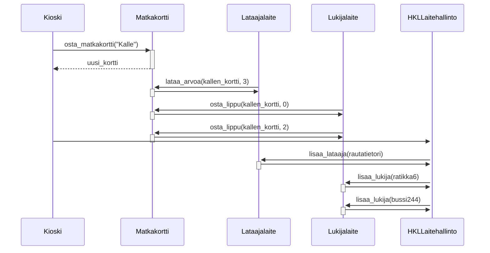

```mermaid
sequenceDiagram
    
    
    Kioski->>+Matkakortti: osta_matkakortti("Kalle")

    Matkakortti-->>-Kioski: uusi_kortti
    
    Lataajalaite->>+Matkakortti: lataa_arvoa(kallen_kortti, 3)

    Matkakortti->>-Lataajalaite: 

    Lukijalaite->>+Matkakortti: osta_lippu(kallen_kortti, 0)

    Matkakortti->>-Lukijalaite: 

    Lukijalaite->>+Matkakortti: osta_lippu(kallen_kortti, 2)

    Matkakortti->>-Lukijalaite: 

    Kioski->>+HKLLaitehallinto: 

    HKLLaitehallinto->>+Lataajalaite: lisaa_lataaja(rautatietori)
    
    Lataajalaite->>-HKLLaitehallinto: 

    HKLLaitehallinto->>+Lukijalaite: lisaa_lukija(ratikka6)

    Lukijalaite->>-HKLLaitehallinto: 

    HKLLaitehallinto->>+Lukijalaite: lisaa_lukija(bussi244)

    Lukijalaite->>-HKLLaitehallinto: 
```