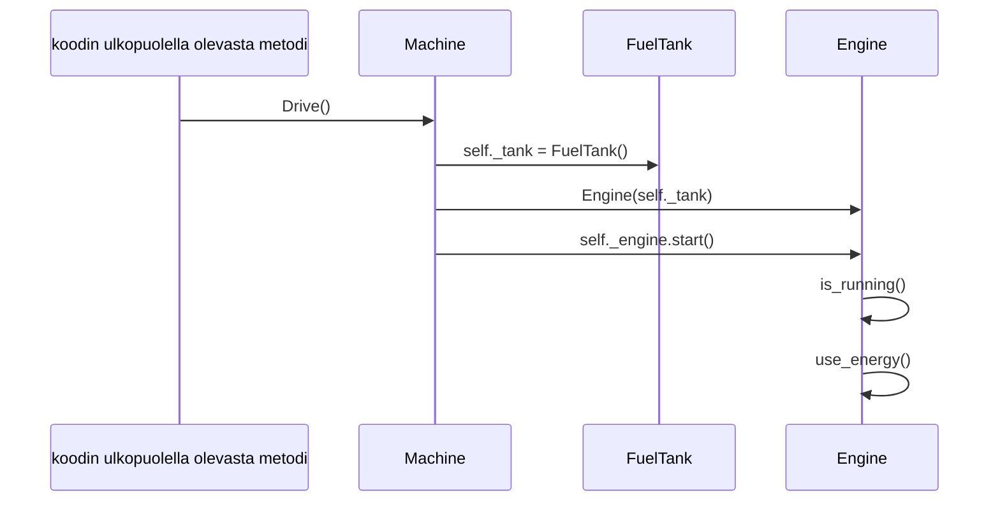

```mermaid
sequenceDiagram
    participant koodin ulkopuolella olevasta metodi
    participant Machine
    participant FuelTank
    participant Engine

    koodin ulkopuolella olevasta metodi ->> Machine: Drive()
    Machine ->> FuelTank:  self._tank = FuelTank()
    Machine ->> Engine:  Engine(self._tank)
  
    Machine ->> Engine: self._engine.start()
    Engine ->> Engine: is_running()
    Engine ->> Engine: use_energy()

```