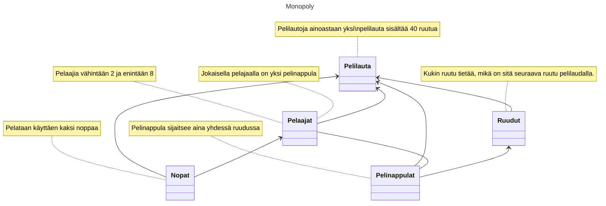

```mermaid
---
title: Monopoly
---
classDiagram

    Pelilauta <-- Nopat
    Pelaajat <-- Nopat
    note for Nopat "Pelataan käyttäen kaksi noppaa"
    Pelilauta <-- Pelaajat
    note for Pelaajat "Pelaajia vähintään 2 ja enintään 8"
    note for Pelaajat "Jokaisella pelajaalla on yksi pelinappula"
    Pelilauta <-- Ruudut
    note for Pelilauta "Pelilautoja ainoastaan yksi\npelilauta sisältää 40 ruutua"
    note for Ruudut "Kukin ruutu tietää, mikä on sitä seuraava ruutu pelilaudalla."
    Pelilauta <-- Pelinappulat
    note for Pelinappulat "Pelinappula sijaitsee aina yhdessä ruudussa"
    Pelaajat  -- Pelinappulat
    Ruudut    <-- Pelinappulat
    
```